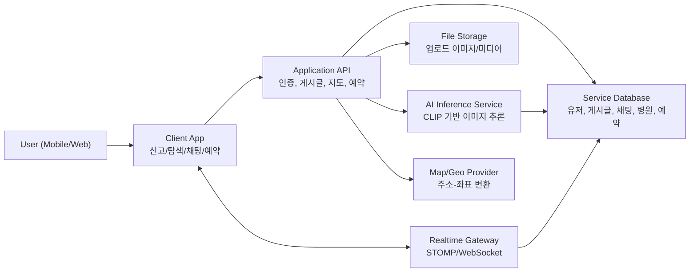

# CatchMe

> 실종 반려동물 대응을 위해 **신고/탐색/추천/소통/케어**를 하나로 연결한 통합 서비스

## 한 줄 요약
CatchMe는 실종/목격 제보를 지도, AI, 실시간 채팅으로 통합해 탐색 시간을 줄이고 재회 가능성을 높입니다.

## 문제 정의
실종 상황에서는 제보가 커뮤니티, 지도, 메신저에 흩어져 빠르게 모으기 어렵습니다.
목격 정보가 들어와도 신뢰도 판단, 당사자 연결까지 시간이 걸립니다.
CatchMe는 신고부터 소통, 후속 케어까지 한 흐름으로 묶어 초기 대응 속도를 높입니다.

## 시스템 아키텍처 핵심 구조
- **Client**: 신고, 탐색, 채팅, 예약 UX
- **Application API**: 인증/게시글/지도/채팅/예약 도메인 처리
- **AI Inference**: 이미지 기반 품종/색상 추론
- **Data Layer**: 사용자/게시글/채팅/예측 결과 저장

설계 철학: 사용자 흐름은 단순하게 유지하고, AI·실시간 처리는 독립적으로 확장합니다.

## 시스템 다이어그램

## 핵심 기능
1. 실종/목격 통합 게시 관리
2. AI 추론 기반 연관 제보 추천
3. 지도 중심 탐색(제보/보호소/병원)
4. 실시간 채팅 기반 즉시 소통
5. 수의사 조회 및 예약 연계
6. JWT 기반 인증/접근 제어

## 기술 스택
- **Client**: React, Vite, React Router, SockJS, STOMP, Kakao Map SDK
- **Backend**: Java 17, Spring Boot, Spring Data JPA, Spring Security, WebSocket/STOMP, JWT
- **AI**: FastAPI, PyTorch, Hugging Face Transformers(CLIP)
- **Infra/Data**: MariaDB(MySQL 호환), File Storage, Geo API

